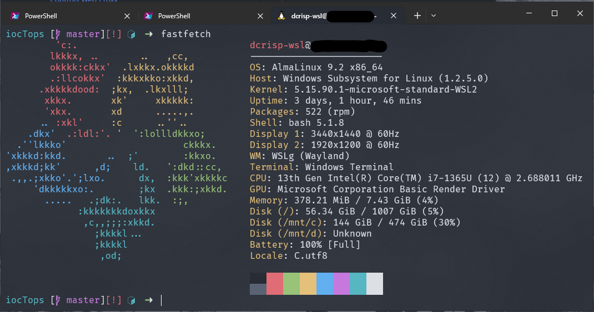

# dev-env
An attempt at more properly defining my personal development enviornment with AlmaLinux9 in WSL2 (Windows)
- *Currently based on a repo shared by mtrudel: https://github.com/mtrudel/dotfiles*
- *so-far, this is a proof of concept. this repo may change quite a bit as I consider how to best separate the subsets of tools this handles/configures...*

## fastfetch



## Preparation
#### Install WSL2 (admin required)
See [learn.microsoft.com](https://learn.microsoft.com/en-us/windows/wsl/install)
- Run ```wsl --install``` from an elevated PowerShell
#### Install AlmaLinux9
See [wiki.almalinux.org](https://wiki.almalinux.org/documentation/wsl.html#about-wsl)
- Install AlmaLinux9 from the Microsoft Store
    - Using winget: `winget install "AlmaLinux 9"`
- Open the AlmaLinux9 _app_. A terminal should open and run stuff. When complete, AlmaLinux9 can be run in WSL.
#### Install Windows Terminal Preview from the Microsoft Store
- Using winget: `winget install "Windows Terminal Preview"`
#### Install a NerdFont
- Install a NerdFont as explained here: [learn.microsoft.com](https://learn.microsoft.com/en-us/windows/terminal/tutorials/custom-prompt-setup#install-a-nerd-font) (I like FiraCode NF)
  - *if using chocolatey:* `choco install firacodenf` (unsure if there's a winget option I'm not seeing)
- Select the installed nerdfont in your Windows Terminal App (as default, or for your AlmaLinux Profile)
#### Initial Steps w/ AlmaLinux
*Open AlmaLinux from within Windows Terminal, then run the following commands*
1. ```dnf check-update && sudo dnf update```
2. ```sudo dnf config-manager --set-enabled crb```
3. ```sudo dnf install epel-release```
4. ```dnf check-update && sudo dnf update```
5. ```sudo dnf upgrade``` (update to AlmaLinux 9.2)
6. ```sudo dnf install git```

## Clone dev-env.git

## Decide what you want to install. Use `./install.sh` to do so.
 - see `install.sh` for basic tools
 - can also call `install.sh` with an argument like `./install.sh nvim`

*you should add a line to your shell-specific dot-file (~/.bashrc, ~/.zshrc) that sources the ~/.profile folder like so: `. ~/.profile`. Remember, this is a work in progress... [todo.md](./todo.md) is where I've offloaded ideas for future improvement (though this repo is **not** my current focus.*


# License
MIT
